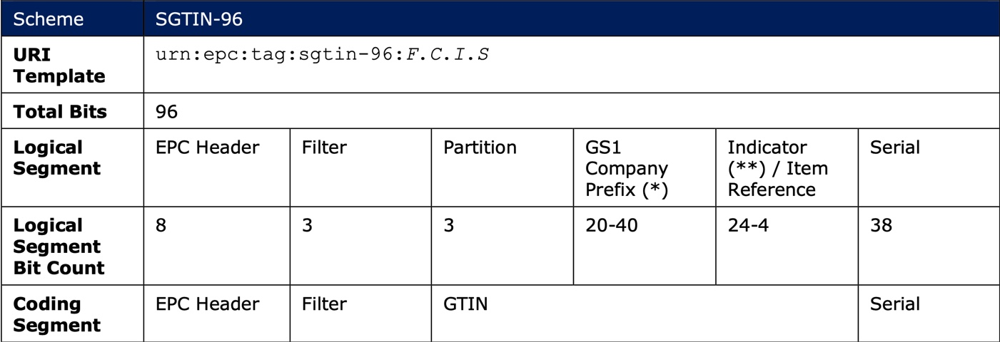
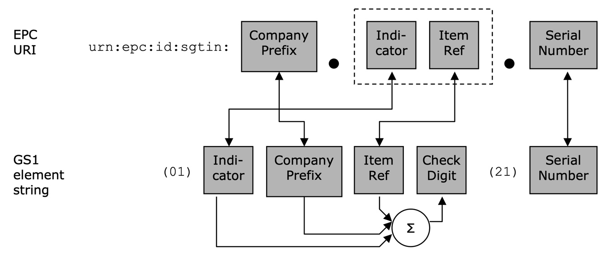

# getGCPLengthDemo

This is a simple DEMO SOFTWARE intended to illustrate how to apply GS1's GCP (GS1 Company Prefix) Length Table (available either in XML or JSON) residing at https://www.gs1.org/standards/bc-epc-interop.

## Before we go on: what is the issue?

If you would like to encode an RFID tag with a proper EPC (Electronic Product Code) or share visibility event data through EPCIS, you need to know the length of the GS1 Company Prefix. Amongst others, this was introduced to ease filtering in RFID read operations or in software applications (e.g. RFID middleware or EPCIS-based software systems).

The length of the GCP can vary (in the case of RFID tags, between 6 and 12 digits). It is based on an organisation's required identification capacity. For instance, someone who sells just a couple of dozens of products through an e-commerce platform, can manage with a 10-digit GCP, allowing him to identify up to 100 products (identified by a Global Trade Item Number or GTIN). However, a multi-national corporation that introduces several hundreds or thousands of products each year, requires much more products, thus is assigned by its local GS1 Member Organisation e.g. a 7-digit GCP enabling the company to identify up 100,000 products.

## Example: SGTIN
For instance, if you need to encode a serialised GTIN (Global Trade Item Number) on an RFID tag, the binary string requires you to indicate the partition value (determining the number of decimal digits of the GCP):



Likewise, if you need to capture or query for EPCIS events in an EPCIS repository leveraging EPC URIs, you e.g. need to separate the GCP from the rest of the key when translating it from the corresponding GS1 element strings:  



## IMPORTANT NOTES

* This software module was developed for DEMONSTRATION purposes only. It is NOT RECOMMENDED implementing it 1:1 in a productive environment. For this reason, it is deliberately not provided as an official package via the Python Packaging Index (PyPI).
* Particularly, I recommend companies to use a local copy of the GCP Length Table that is updated in regular (e.g. daily) intervals. If companies also have a separate file containing own GCP length entries, the latter should ideally be (a) formatted similarly and (b) kept separately to ease maintenance of the two files.
* The latter approach is faster and far more efficient than triggering an online lookup every time the function is called (as this demo software does). In this regard, note that the GCP length table (.json) at the time of writing this software (July 2020) already is > 5 MB in size.
* The function supports all GS1 Keys that are applicable to construct EPC values, specifically: 
SSCC, GTIN, GDTI, GCN, GINC, GSIN, GLN (for parties and physical locations), GRAI, GIAI, ITIP, CPID, GSRN-P, and GSRN.

## References

* EPC Tag Data Standard, Release 1.13, Ratified, Nov 2019, https://www.gs1.org/standards/epcrfid-epcis-id-keys/epc-rfid-tds/1-13
* GS1 RFID/Barcode Interoperability Guideline, Release 1.1, Ratified, Nov 2016, https://www.gs1.org/standards/bc-epc-interop

## Usage
Run the examples via
```
pip3 install -r requirements.txt
python3 validExamples.py
```
See `validExamples.py` (or `invalidExamples.py`, respectively) for how to use the script.

## License

<br />

Copyright 2020 | Ralph Tröger <ralph.troeger@gs1.de>

Permission is hereby granted, free of charge, to any person obtaining a copy of this software and associated documentation files (the "Software"), to deal in the Software without restriction, including without limitation the rights to use, copy, modify, merge, publish, distribute, sublicense, and/or sell copies of the Software, and to permit persons to whom the Software is furnished to do so, subject to the following conditions:

The above copyright notice and this permission notice shall be included in all copies or substantial portions of the Software.

THE SOFTWARE IS PROVIDED "AS IS", WITHOUT WARRANTY OF ANY KIND, EXPRESS OR IMPLIED, INCLUDING BUT NOT LIMITED TO THE WARRANTIES OF MERCHANTABILITY, FITNESS FOR A PARTICULAR PURPOSE AND NONINFRINGEMENT. IN NO EVENT SHALL THE AUTHORS OR COPYRIGHT HOLDERS BE LIABLE FOR ANY CLAIM, DAMAGES OR OTHER LIABILITY, WHETHER IN AN ACTION OF CONTRACT, TORT OR OTHERWISE, ARISING FROM, OUT OF OR IN CONNECTION WITH THE SOFTWARE OR THE USE OR OTHER DEALINGS IN THE SOFTWARE.